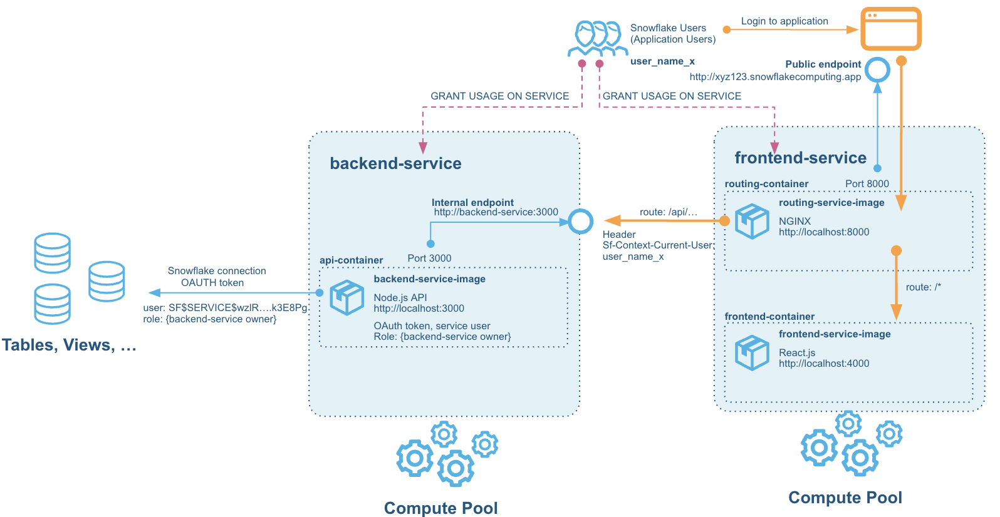
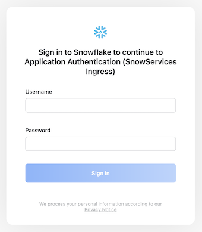
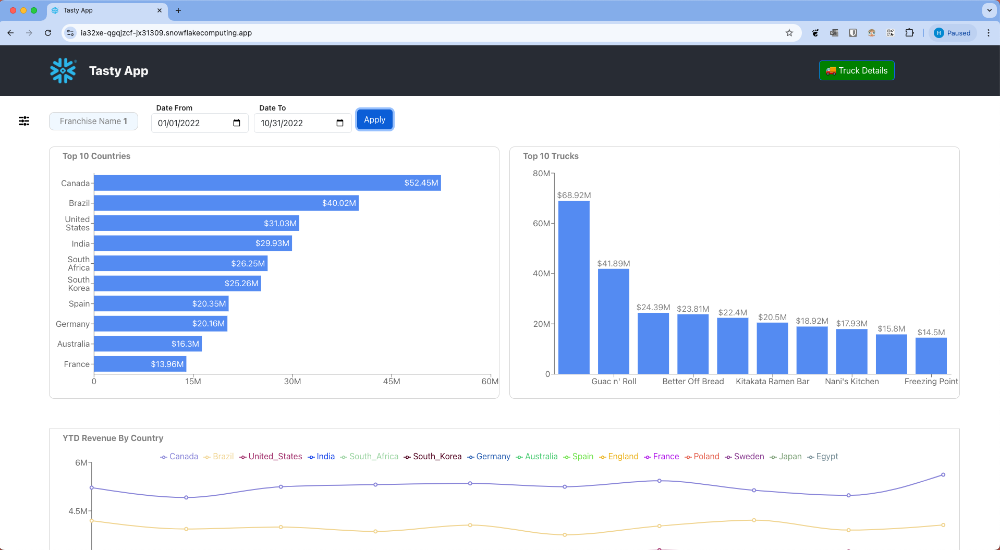

# Snowflake Application Deployment with Snowpark Container Services

## Overview

This guide provides a comprehensive setup for deploying a containerized application on Snowflake's Snowpark Container Services. The application consists of a backend service (Node.js API) and a frontend service (React.js), both integrated with Snowflake.

## Prerequisites

Ensure the following tools are installed on your system:
- **[VSCode](https://code.visualstudio.com/)**: Development environment
- **[Docker](https://docs.docker.com/get-docker/)**: For containerizing and running services
- **[Git](https://git-scm.com/)**: Version control
- **[Node.js](https://nodejs.org/en/)**: JavaScript runtime
- **[NPM](https://www.npmjs.com/)**: Package manager for JavaScript

## Architecture



The architecture of this application includes:
- **Frontend Service**: Developed with React.js, served through NGINX.
- **Backend Service**: Exposes APIs using Node.js and connects to Snowflake with OAuth tokens.
- **Compute Pool**: Runs frontend and backend services.
- **Snowflake Integration**: Backend connects to Snowflake for data access.

## Snowflake Setup and Data Preparation

### Step 1: Change Role to Account Admin

```sql
USE ROLE ACCOUNTADMIN;
```

### Step 2: Create Virtual Warehouse for Data Exploration

```sql
CREATE OR REPLACE WAREHOUSE query_wh WITH 
    WAREHOUSE_SIZE = 'MEDIUM' 
    WAREHOUSE_TYPE = 'STANDARD' 
    AUTO_SUSPEND = 300 
    AUTO_RESUME = TRUE 
    MIN_CLUSTER_COUNT = 1 
    MAX_CLUSTER_COUNT = 1;
```

### Step 3: Create Database and Schema

```sql
CREATE OR REPLACE DATABASE frostbyte_tasty_bytes;
CREATE OR REPLACE SCHEMA app;
```

### Step 4: Create Table for Order Data

```sql
CREATE OR REPLACE TABLE app.orders (
    order_id NUMBER(38,0),
    truck_id NUMBER(38,0),
    order_ts TIMESTAMP_NTZ(9),
    order_detail_id NUMBER(38,0),
    line_number NUMBER(38,0),
    truck_brand_name VARCHAR(16777216),
    menu_type VARCHAR(16777216),
    primary_city VARCHAR(16777216),
    region VARCHAR(16777216),
    country VARCHAR(16777216),
    franchise_flag NUMBER(38,0),
    franchise_id NUMBER(38,0),
    franchisee_first_name VARCHAR(16777216),
    franchisee_last_name VARCHAR(16777216),
    location_id NUMBER(19,0),
    customer_id NUMBER(38,0),
    first_name VARCHAR(16777216),
    last_name VARCHAR(16777216),
    e_mail VARCHAR(16777216),
    phone_number VARCHAR(16777216),
    children_count VARCHAR(16777216),
    gender VARCHAR(16777216),
    marital_status VARCHAR(16777216),
    menu_item_id NUMBER(38,0),
    menu_item_name VARCHAR(16777216),
    quantity NUMBER(5,0),
    unit_price NUMBER(38,4),
    price NUMBER(38,4),
    order_amount NUMBER(38,4),
    order_tax_amount VARCHAR(16777216),
    order_discount_amount VARCHAR(16777216),
    order_total NUMBER(38,4)
);
```

### Step 5: Create Virtual Warehouse for Data Loading

```sql
CREATE OR REPLACE WAREHOUSE load_wh WITH 
    WAREHOUSE_SIZE = 'LARGE' 
    WAREHOUSE_TYPE = 'STANDARD' 
    AUTO_SUSPEND = 300 
    AUTO_RESUME = TRUE 
    MIN_CLUSTER_COUNT = 1 
    MAX_CLUSTER_COUNT = 1;
```

### Step 6: Create Stage for Loading Data

```sql
CREATE OR REPLACE STAGE tasty_bytes_app_stage
    URL = 's3://sfquickstarts/frostbyte_tastybytes/app/orders/';
```

### Step 7: Copy Data into Orders Table

```sql
COPY INTO app.orders FROM @tasty_bytes_app_stage;
```

### Step 8: Change Virtual Warehouse Context to Query Data

```sql
USE WAREHOUSE query_wh;
```

### Step 9: Data Exploration Queries

- **Sample Data**: `SELECT * FROM orders LIMIT 10;`
- **Count Records**: `SELECT COUNT(*) FROM orders;`
- **Sales by Month**:
  ```sql
  SELECT MONTH(order_ts), MONTHNAME(order_ts), SUM(price)
  FROM orders 
  GROUP BY MONTH(order_ts), MONTHNAME(order_ts)
  ORDER BY MONTH(order_ts);
  ```

## Role and Permission Setup

1. **Create Admin Role and Grant Permissions**

    ```sql
    USE DATABASE frostbyte_tasty_bytes;
    USE SCHEMA APP;

    CREATE ROLE tasty_app_admin_role;

    GRANT ALL ON DATABASE frostbyte_tasty_bytes TO ROLE tasty_app_admin_role;
    GRANT ALL ON SCHEMA frostbyte_tasty_bytes.app TO ROLE tasty_app_admin_role;
    GRANT SELECT ON ALL TABLES IN SCHEMA frostbyte_tasty_bytes.app TO ROLE tasty_app_admin_role;
    GRANT SELECT ON FUTURE TABLES IN SCHEMA frostbyte_tasty_bytes.app TO ROLE tasty_app_admin_role;
    ```

2. **Create Application Warehouse**

    ```sql
    CREATE OR REPLACE WAREHOUSE tasty_app_warehouse WITH
        WAREHOUSE_SIZE='X-SMALL'
        AUTO_SUSPEND = 180
        AUTO_RESUME = TRUE
        INITIALLY_SUSPENDED=FALSE;

    GRANT ALL ON WAREHOUSE tasty_app_warehouse TO ROLE tasty_app_admin_role;
    ```

## Building and Running the Backend

1. **Clone the Repository**

   ```bash
   git clone https://github.com/Snowflake-Labs/sfguide-tasty-bytes-zero-to-app-with-spcs.git zero-to-app-spcs
   ```

2. **Configure Environment Variables**

   Copy the `.env.example` file to `.env` and populate it with Snowflake credentials.

3. **Run Backend Locally**

   ```bash
   docker compose up
   ```

4. **Test Backend Endpoint**

   ```bash
   curl http://localhost:3000/franchise/1
   ```

## Configuring Snowflake Authentication and Service Creation

### Creating Services on Snowpark
1. **Create Backend Service on Snowpark**

    ```sql
    CREATE SERVICE backend_service
      IN COMPUTE POOL tasty_app_backend_compute_pool
      FROM SPECIFICATION $$
    spec:
      container:
      - name: backend
        image: /frostbyte_tasty_bytes/app/tasty_app_repository/backend_service_image:tutorial
        env:
          PORT: 3000
          ACCESS_TOKEN_SECRET: pmerJtdQjYR+Qd7k
          REFRESH_TOKEN_SECRET: pmerJtdQjYR+Qd7k
          CLIENT_VALIDATION: Snowflake
      endpoint:
      - name: apiendpoint
        port: 3000
        public: true
    $$
      MIN_INSTANCES=1
      MAX_INSTANCES=1;
    GRANT USAGE ON SERVICE backend_service TO ROLE tasty_app_ext_role;
    ```

2. **Verify Service Status and Logs**

    ```sql
    SELECT SYSTEM$GET_SERVICE_STATUS('backend_service');
    CALL SYSTEM$GET_SERVICE_LOGS('backend_service', '0', 'backend', 50);
    ```

1. **Create Frontend Service on Snowpark**

  The frontend service can now be created in a similar fashion. The difference here is that it will contain two different containers, we are using both the image for the router and the frontend React app inside the same service.

    ```sql
    CREATE SERVICE frontend_service
      IN COMPUTE POOL tasty_app_frontend_compute_pool
      FROM SPECIFICATION $$
    spec:
      container:
      - name: frontend
        image: /frostbyte_tasty_bytes/app/tasty_app_repository/frontend_service_image:tutorial
        env:    
          PORT: 4000
          FRONTEND_SERVICE_PORT: 4000
          REACT_APP_BACKEND_SERVICE_URL: /api
          REACT_APP_CLIENT_VALIDATION: Snowflake
      - name: router
        image: /frostbyte_tasty_bytes/app/tasty_app_repository/router_service_image:tutorial
        env:
          FRONTEND_SERVICE: localhost:4000
          BACKEND_SERVICE: backend-service:3000
      endpoint:
      - name: routerendpoint
        port: 8000
        public: true
    $$
      MIN_INSTANCES=1
      MAX_INSTANCES=1;
    GRANT USAGE ON SERVICE frontend_service TO ROLE tasty_app_ext_role;
    ```

2. **Verify Service Status and Logs**

    ```sql
    SELECT SYSTEM$GET_SERVICE_STATUS('frontend-service');
    CALL SYSTEM$GET_SERVICE_LOGS('frontend_service', '0', 'frontend', 50);
    CALL SYSTEM$GET_SERVICE_LOGS('frontend_service', '0', 'router', 50);
    ```

## Testing and Final Steps

1. **Test Application**

   Retrieve the public endpoint URL using:
   ```sql
   SHOW ENDPOINTS IN SERVICE frontend_service;
   ```

   Now open up that URL in a browser. You will be prompted for a login, and here we can choose any of the users created earlier. You can use user1 with password password1. Note that you will be forced to change this on first login.
   
   

   Once logged in, the application loads the authorization status, and then redirects the user to the logged in Home page. After a few moments the data is loaded also and the charts for the current franchise (Franchise 1, if you logged in with user1) is shown.

   

2. **Useful Commands**

   - **Show Services**: `SHOW SERVICES;`
   - **Show Roles**: `SHOW ROLES IN SERVICE frontend_service;`
   - **Grant Role**: `GRANT SERVICE ROLE frontend_service!ALL_ENDPOINTS_USAGE TO ROLE tasty_app_ext_role;`

## Cleanup of resources

Once we have tested the application we can tear down any resources that we have created. The following resouces should be removed:

- Services
- Compute Pools
- Warehouses
- Image Repositories
- Database and Schema
- Security Integration (NOTE: this may be used by other services, you can only have one active per ACCOUNT)
- Roles
- Users
- Local Docker images
Open a worksheet in Snowflake and run the following SQL:

```shell
docker image prune --all
```

```sql
USE DATABASE FROSTBYTE_TASTY_BYTES;
USE SCHEMA APP;
USE ROLE tasty_app_admin_role;

-- Delete services
SHOW SERVICE;
DROP SERVICE BACKEND_SERVICE;
DROP SERVICE FRONTEND_SERVICE;

-- Delete compute pools
SHOW COMPUTE POOLS;
USE ROLE ACCOUNTADMIN;
DROP COMPUTE POOL TASTY_APP_BACKEND_COMPUTE_POOL;
DROP COMPUTE POOL TASTY_APP_FRONTEND_COMPUTE_POOL;

-- Delete warehouses
SHOW WAREHOUSES;
DROP WAREHOUSE LOAD_WH;
DROP WAREHOUSE QUERY_WH;
DROP WAREHOUSE TASTY_APP_WAREHOUSE;

-- Delete the Image repository
USE ROLE tasty_app_admin_role;
SHOW IMAGE REPOSITORIES;
DROP IMAGE REPOSITORY TASTY_APP_REPOSITORY;

-- Delete the database
USE ROLE ACCOUNTADMIN;
SHOW DATABASES;
DROP DATABASE FROSTBYTE_TASTY_BYTES;

-- Delete the OAuth security integration
USE ROLE tasty_app_admin_role;
SHOW SECURITY INTEGRATIONS;
DROP SECURITY INTEGRATION "Application Authentication";

-- Delete the roles
USE ROLE ACCOUNTADMIN;
SHOW ROLES;
DROP ROLE TASTY_APP_ADMIN_ROLE;
DROP ROLE TASTY_APP_EXT_ROLE;

-- Delete the users
SHOW USERS;
DROP USER USER1;
DROP USER USER2;
DROP USER USER3;
```